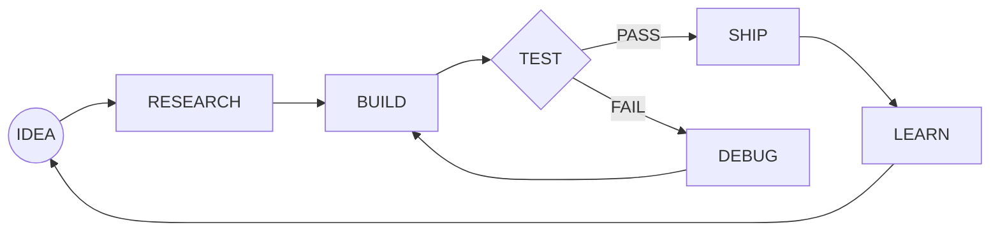
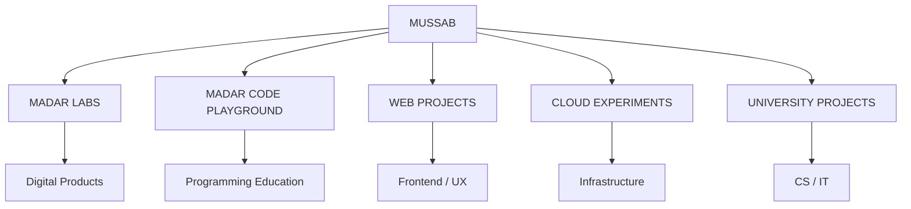
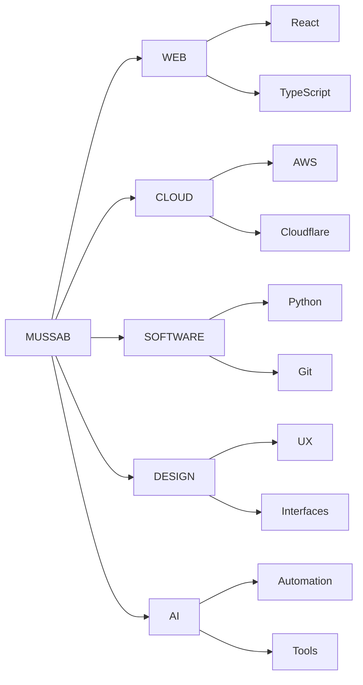

<!-- ============================================================
  MUSSAB ALHASHMMEY // GITHUB PROFILE
  ULTRA INTERFACE
  Theme: Deep Space / Neon Indigo / Electric Blue
============================================================ -->

<div align="center">


<br/>


<br/>


<br/><br/>


</div>

---
<div align="center">


</div>

---

# `01 // IDENTITY`

```yaml
identity:
  name: Mussab Alhashmmey

  role:
    - IT Student
    - Developer
    - Builder

  interests:
    - software
    - web
    - cloud
    - digital products
    - technology

  operating_mode:
    - explore
    - understand
    - build
    - break
    - fix
    - improve
    - ship

  status: ONLINE
```

> I enjoy taking ideas that exist only as concepts and turning them into real digital systems.

> The fastest way for me to understand technology is to build something with it.

---

<div align="center">

## `SIGNAL // LIVE`


</div>

---
---

# `CURRENT MISSION`

<div align="center">


</div>

---
# `02 // TECH MATRIX`

<div align="center">


<br/><br/>


</div>

---
<details>
<summary><code>&gt; sudo access mussab.core</code></summary>

<br/>

<div align="center">


</div>

<br/>

</details>

---
# `03 // KNOWLEDGE ORBIT`



<details open>
<summary><b>☁️ CLOUD SYSTEMS</b></summary>

<br/>

```txt
STATUS       : LEARNING
INTEREST     : HIGH

AWS          █████████░░░░░░░░░░░
Cloudflare   ███████████████░░░░░
Deployment   ██████████████░░░░░░
Architecture ████████░░░░░░░░░░░░
```

Focus:

- Cloud Computing
- AWS
- Cloudflare
- Deployment workflows
- Hosting architecture
- Scalability
- Infrastructure concepts

</details>

<details>
<summary><b>⚛️ APPLICATION DEVELOPMENT</b></summary>

<br/>

```txt
React        █████████████░░░░░░░
TypeScript   ███████████░░░░░░░░░
JavaScript   █████████████░░░░░░░
Python       █████████░░░░░░░░░░░
Git          ███████████████░░░░░
```

Current focus:

- Modern frontend development
- Full-stack architecture
- APIs
- Authentication
- Databases
- Clean project structure
- Git workflows

</details>

<details>
<summary><b>🧠 COMPUTER SCIENCE</b></summary>

<br/>

Current academic orbit:

```txt
Computer Networks
Database Management Systems
System Analysis & Design
Human Computer Interaction
Statistics
Software Engineering
```

</details>

---
---

# `PROJECT COMMAND CENTER`

<div align="center">


</div>

---
# `04 // PROJECT CONSTELLATION`

<div align="center">



</div>

<details open>
<summary><b>🛰️ ACTIVE PROJECTS</b></summary>

<br/>

| SYSTEM | DOMAIN | STATE |
|---|---|---:|
| **MADAR LABS** | Digital products & experiments | 🟣 BUILDING |
| **Madar Code Playground** | Programming education | 🔵 DEVELOPMENT |
| **Web Experiments** | Interfaces / UX / Apps | 🟢 ACTIVE |
| **Cloud Experiments** | Hosting / Infrastructure | 🟠 LEARNING |
| **University Projects** | CS / IT | ⚪ ONGOING |

</details>

<details>
<summary><b>🧪 EXPERIMENT QUEUE</b></summary>

<br/>

```txt
QUEUE
│
├── [ ] Full-stack application
├── [ ] Authentication system
├── [ ] Database-driven product
├── [ ] Automation tool
├── [ ] AI-powered application
├── [ ] Cloud-native experiment
├── [ ] Open-source project
└── [∞] Build something unexpected
```

</details>

---

# `05 // GITHUB TELEMETRY`

<div align="center">


<br/>


</div>

---

# `06 // ACTIVITY CORE`

<div align="center">


</div>

---

# `07 // NEON CONTRIBUTION ENGINE`

<div align="center">

<picture>
  <source
    media="(prefers-color-scheme: dark)"
    srcset="https://raw.githubusercontent.com/mosabalhashmmey-alt/mosabalhashmmey-alt/output/github-contribution-grid-snake-dark.svg"
  />
  <source
    media="(prefers-color-scheme: light)"
    srcset="https://raw.githubusercontent.com/mosabalhashmmey-alt/mosabalhashmmey-alt/output/github-contribution-grid-snake.svg"
  />
  
</picture>

<br/>


<br/>

<code>LIVE CONTRIBUTION FEED</code>
&nbsp;
<code>AUTO-UPDATED DAILY</code>
&nbsp;
<code>NEON MODE ACTIVE</code>

</div>

---
---

# `LIVE ENGINE`

<div align="center">


</div>

---
# `08 // SIGNAL HISTORY`

<div align="center">


</div>

---

# `09 // ACTIVITY INTELLIGENCE`

<div align="center">


</div>

<details>
<summary><b>📡 TELEMETRY NOTES</b></summary>

<br/>

```txt
SIGNAL SOURCE     : GitHub activity
TIMEZONE          : UTC+03
PROFILE STATE     : ACTIVE
DATA MODE         : LIVE / GENERATED
VISUAL THEME      : DEEP SPACE
```

</details>

---

# `10 // DEVELOPER TERMINAL`

```console
┌──(mussab㉿github)-[~/workspace]
│
├─$ whoami
│  Mussab Alhashmmey
│
├─$ uname -a
│  Developer / Builder / IT Student
│
├─$ pwd
│  /home/mussab/future
│
├─$ cat priorities.txt
│  learn
│  understand
│  build
│  ship
│
├─$ git status
│  On branch future
│
│  Changes not staged for commit:
│    new ideas
│    new skills
│    new experiments
│
├─$ ./build-future.sh
│
│  [███████████████████░] 96%
│
│  Warning:
│  completion is intentionally disabled.
│
└─$ _
```

---

# `11 // INTERACTIVE CONTROL PANEL`

<details>
<summary><b>▶ EXECUTE: developer.profile</b></summary>

<br/>

```json
{
  "name": "Mussab",
  "mode": "builder",
  "curiosity": 100,
  "projects": "active",
  "learning": "continuous",
  "preferred_environment": [
    "web",
    "cloud",
    "software"
  ],
  "objective": "turn ideas into real systems"
}
```

</details>

<details>
<summary><b>▶ EXECUTE: system.personality</b></summary>

<br/>

```yaml
thinking:
  curious: true
  experimental: true
  iterative: true

workflow:
  - explore
  - test
  - learn
  - improve

rules:
  - never stop learning
  - small experiments are valuable
  - understand before scaling
  - working software beats perfect ideas
```

</details>

<details>
<summary><b>▶ EXECUTE: random.facts</b></summary>

<br/>

```txt
01 // I like testing tools before deciding if they deserve a place in my workflow.

02 // I care about how software feels, not only how it works.

03 // Small experiments often become bigger projects.

04 // GitHub is becoming my digital workshop.

05 // The fastest way for me to learn technology is by building.

06 // Bugs are usually just undocumented lessons.
```

</details>

<details>
<summary><b>▶ EXECUTE: build.philosophy</b></summary>

<br/>

```text
                         START
                           │
                           ▼
                    ┌─────────────┐
                    │    IDEA     │
                    └──────┬──────┘
                           │
                           ▼
                    ┌─────────────┐
                    │    BUILD    │
                    └──────┬──────┘
                           │
                           ▼
                 ┌──────────────────┐
                 │ SOMETHING BROKE  │
                 └────────┬─────────┘
                          │
                          ▼
                    ┌─────────────┐
                    │ UNDERSTAND  │
                    └──────┬──────┘
                           │
                           ▼
                    ┌─────────────┐
                    │     FIX     │
                    └──────┬──────┘
                           │
                           ▼
                    ┌─────────────┐
                    │    SHIP     │
                    └──────┬──────┘
                           │
                           ▼
                    ┌─────────────┐
                    │    LEARN    │
                    └──────┬──────┘
                           │
                           └──────────────↺
```

</details>

<details>
<summary><b>▶ EXECUTE: future.queue</b></summary>

<br/>

```bash
future.queue --list

[ACTIVE] learn deeper software engineering
[ACTIVE] understand cloud infrastructure
[ACTIVE] build better applications
[WAIT]   contribute to open source
[WAIT]   launch new experiments
[∞]      keep building
```

</details>

---

# `12 // SYSTEM DIAGNOSTICS`

<div align="center">

| MODULE | HEALTH | STATE |
|:---|:---:|:---:|
| Curiosity Engine | ██████████ | 🟢 ONLINE |
| Idea Generator | ██████████ | 🟣 OVERCLOCKED |
| Debugging Patience | ███████░░░ | 🟡 VARIABLE |
| Git Confidence | ████████░░ | 🔵 INCREASING |
| Cloud Knowledge | ██████░░░░ | 🔵 LOADING |
| Stack Overflow Instinct | █████████░ | 🟢 ONLINE |
| Coffee Module | █████░░░░░ | ☕ OPTIONAL |
| New Project Temptation | ██████████ | 🔴 CRITICAL |

</div>

---

# `13 // NETWORK MAP`



---

# `14 // BUILD METRICS`

```txt
╭─────────────────────────────────────────────╮
│             DEVELOPMENT METRICS             │
├─────────────────────────────────────────────┤
│ Curiosity              █████████████  100% │
│ Willingness to learn   █████████████  100% │
│ Projects completed     ████░░░░░░░░░   ??% │
│ Bugs created           █████████████  100% │
│ Bugs understood        █████████░░░░   72% │
│ Cloud mastery          ██████░░░░░░░   46% │
│ Ideas remaining        ∞                    │
╰─────────────────────────────────────────────╯
```

---

# `15 // HUMAN API`

<details>
<summary><b>GET /api/mussab</b></summary>

<br/>

```http
HTTP/1.1 200 OK
Content-Type: application/json
```

```json
{
  "user": "mussab",
  "online": true,
  "learning": true,
  "building": true,
  "availableMemory": "depends on exam week",
  "ideas": "unlimited"
}
```

</details>

<details>
<summary><b>POST /api/mussab/idea</b></summary>

<br/>

```http
POST /api/mussab/idea HTTP/1.1
Content-Type: application/json

{
  "idea": "something interesting"
}
```

```http
HTTP/1.1 202 ACCEPTED

{
  "status": "probably becoming a project"
}
```

</details>

---

# `16 // RUNTIME LOG`

```log
[21:04:03] INFO     curiosity-engine initialized
[21:04:05] INFO     loading developer tools...
[21:04:06] OK       git detected
[21:04:06] OK       cloud curiosity detected
[21:04:07] OK       project ideas detected
[21:04:07] WARN     too many project ideas detected
[21:04:09] INFO     starting build cycle
[21:04:12] ERROR    something broke
[21:04:14] INFO     learning why
[21:04:38] OK       problem understood
[21:05:02] OK       fix deployed
[21:05:04] INFO     generating another idea...
```

---

# `17 // PROJECT DNA`

<div align="center">

```text
                     MUSSAB
                        │
            ┌───────────┼───────────┐
            │           │           │
            ▼           ▼           ▼
          CODE        CLOUD       DESIGN
            │           │           │
            └───────┬───┴───┬───────┘
                    │       │
                    ▼       ▼
                 SYSTEMS   IDEAS
                    │       │
                    └───┬───┘
                        ▼
                     BUILD
```

</div>

---

# `18 // END OF TRANSMISSION`

<div align="center">


<br/>

### `CODE // CLOUD // SYSTEMS // IDEAS // EXPERIMENTS`

<br/>

```txt
The goal is not to know everything.

The goal is to keep becoming capable
of building things I couldn't build yesterday.
```

<br/>


<br/>


</div>
